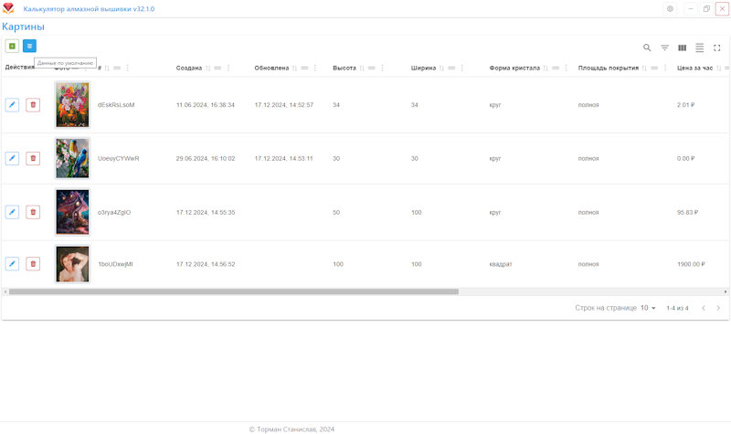

# <table>
<tr>
    <td>
        
    </td>
    <td>
        Diamond-Embroidery-Calculator 
        Калькулятор алмазной вышивки
    </td>
</tr>
</table>

###

Приложение позволяет вести учёт картин алмазной вышивки. 
Помогает оценивать их стоимость и учитывать их продажи, а так же учитывать затраты на материалы и временя на их изготовление. 
Поддержка 25 стилей(темы) внешнего вида приложения. 
Приложение автоматически обновляется при выходе новой версии. 
Поддержка платформ: Windows 10 и выше. 
 

[Инструкция для пользователей программы](./README_FOR_USERS.md)

[Техническое описание](./README_PROJECT_DESCRIPTION.md)
 

## Установка
Скачайте установочный файл **Diamond-embroidery-calculator-Setup-номер версии.exe** со страницы по [ссылке на последний релиз приложения](https://github.com/stanislav0305/Diamond-Embroidery-Calculator/releases/latest). 
И запустите его для установки. 

## Поддержка платформ
Каждый релиз приложения "Калькулятор алмазной вышивки" содержит двоичные файлы для Windows.
- Windows (Windows 10 и выше), поддержка более старых версий Windows не гарантируется.

## Лицензия
[MIT](./LICENSE)