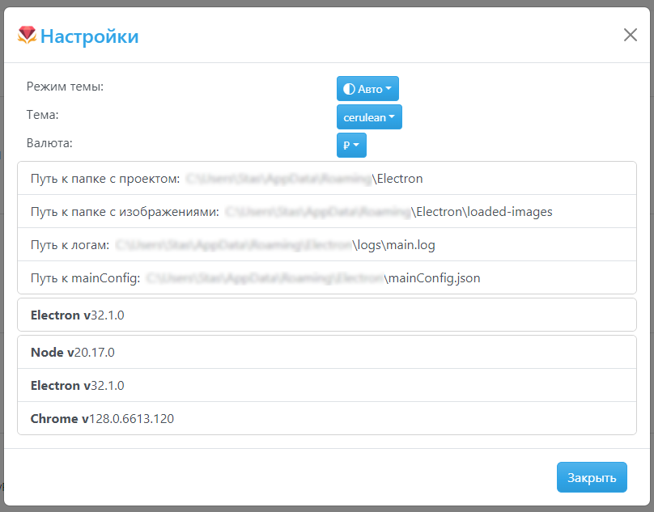
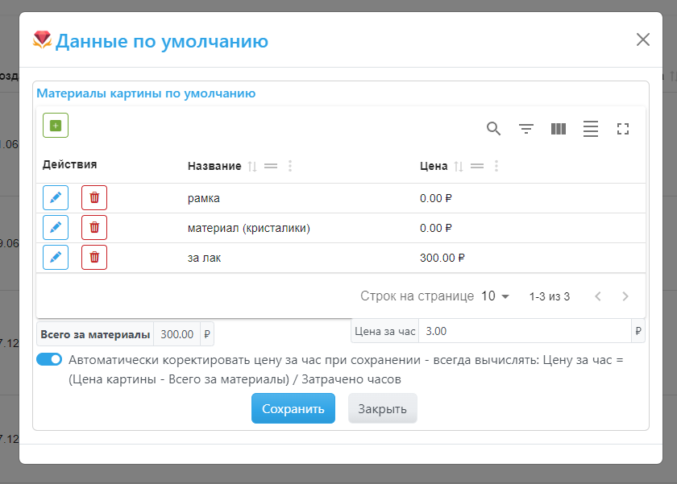
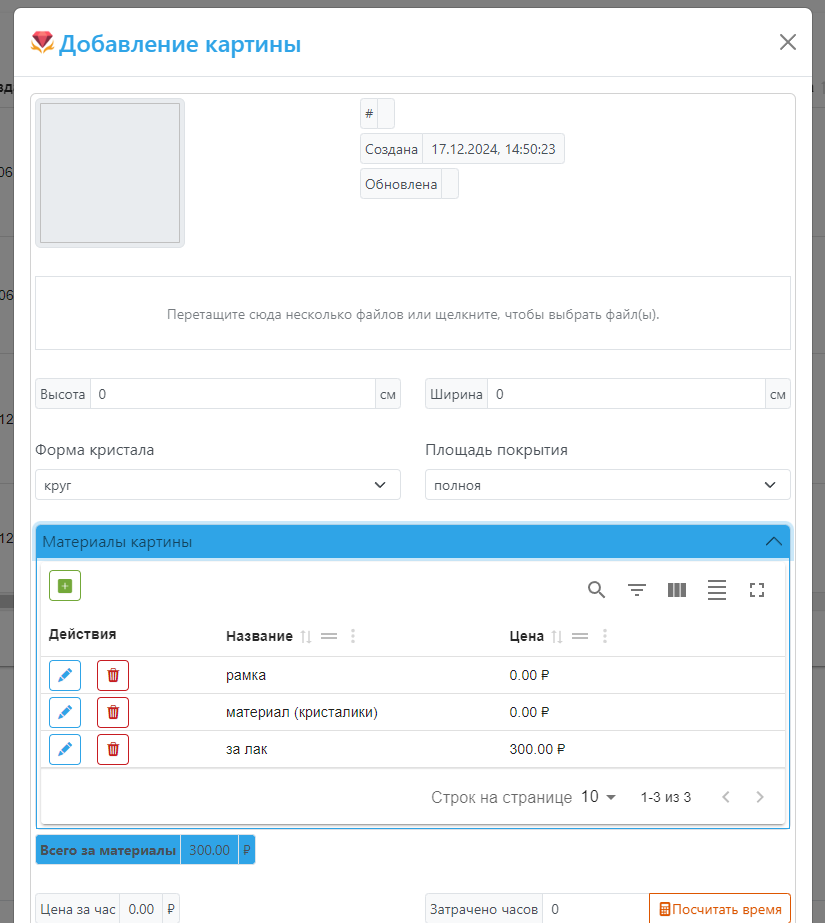
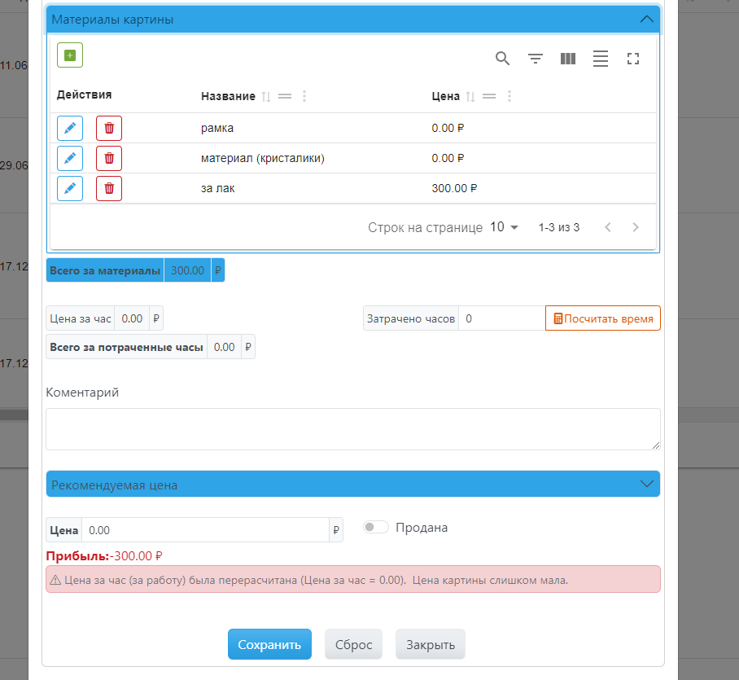
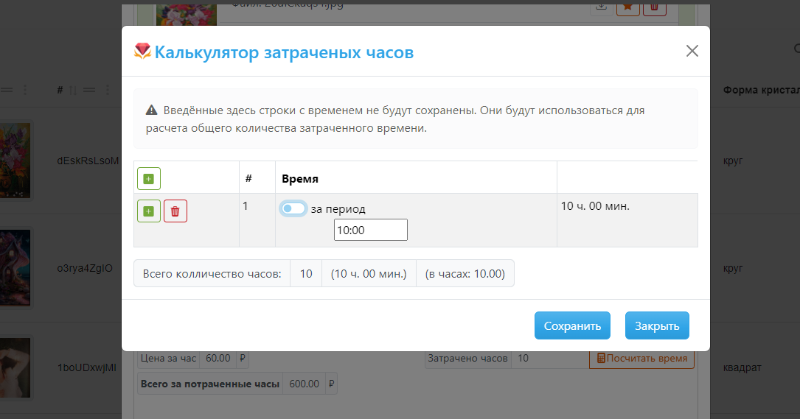

# <table>
<tr>
    <td>
        
    </td>
    <td>
        Diamond-Embroidery-Calculator Калькулятор алмазной вышивки
    </td>
</tr>
</table>

# Инструкция для пользователей программы

## Главное окно приложения 
В главном окне приложения отображается таблица со списком всех картин.

  
В шапке окна, кроме кнопок для работы с окном, есть кнопка:  
-  - для открытия [окна настроек приложения](#окно-настройки-приложения).  
    В этих настройках можно настроить внешний вид окон приложения (темы), изменить валюту и другие настройки приложения.  

Над таблицей расположены кнопки:
-  - кнопка "Данные по умолчанию" - для открытия [окна настроек данных по умолчанию](#окно-настроек-данных-по-умолчанию). Их стоит настроить при первых запусках приложения для удобства работы в дальнейшем.
-  - кнопка "Добавить картину" - для открытия [окна добавления картины](#окно-добавления-картины) в список.  

В таблице есть колонка "Действия", в ней расположены кнопки для работы с определённой строкой таблицы (конкретной картиной).  
Это кнопки:
-  - кнопка для редактирования картины
-  - кнопка для удаления картины

В верху таблицы есть кнопки для работы с данными таблицы:  
  
Это кнопки:
- кнопка поиска для подсветки фрагмента текста во всех колонках на текущей странице таблицы, 
- кнопка включения отображения фильтров для всех колонок. С помочью этих фильтров можно вести отбор и поиск данных в таблице.
- кнопка, включающая окно для скрытия и показа колонок таблицы. В этом окне можно скрыть ненужные колонки в таблице.
- кнопка "изменить плоскость" - для увеличения или уменьшения ширины строк таблицы
- кнопка "включить полно экранный режим" - для открытия полноэкранного режима

В низу таблицы кнопки перехода на следующую страницу таблицы. Количеством строк на каждой странице можно изменять там же.  

У каждой колонки таблицы есть кнопки:  
  
Это кнопки:
- кнопка сортировки
- кнопка перемещения колонки, если за неё "потянуть", то можно переместить колонку и таким образом можно менять порядок колонок по своему усмотрению.
- кнопка с функциями над текущей колонкой

## Окно настройки приложения

В этих настройках можно:
- настроить внешний вид окон приложения:
    - режим темы 
    - темы (их 25), 
- изменить валюту
- узнать расположение:
    - установленного приложения
    - путь к папке с изображениями картин
    - путь к логам приложения
    - путь к файлу конфигурации приложения
    - номера версий компонентов приложения

Если изменить любые параметры, то они будут применены сразу и будут использоваться при следующем запуске приложения.

## Окно настроек данных по умолчанию

Тут можно настроить:
- материалы картины по умолчанию при добавлении картины. Сюда добавляю те материалы для картины которые используются в большинстве картин.  
С помощью кнопок , ,  можно добавить, редактировать или удалить материал.
А также добавить цену материала если она известна. При добавлении новой картины эти материалы будут добавлены в неё. В данных картины можно в любое время добавить новые материалы или удалить лишние.
- можно ввести цену за час которая будет использоваться в расчётах рекомендуемой цены картины. Введите минимальную цену за час, за которую готовы работать.
- можно включить или отключить настройку "Автоматически корректировать цену за час при сохранении - всегда вычислять: Цена за час = (Цена картины - Всего за материалы) / Затрачено часов" - т.е. не учитывать настройку "Цена за час" в [окне настроек данных по умолчанию](#окно-настроек-данных-по-умолчанию), а рассчитывать её при вводе данных картины.

После введения всех настроек нажмите кнопку "Сохранить", для сохранения изменений.

## Окно добавления картины
Это окно для добавления или редактирования картины.

В этом окне есть поля:
- **`#`** - уникальный номер записи (генерируется автоматически)
- **`Создана`** - дата добавления картины в программу учёта (заполняется автоматически)
- **`Обновлена`** - дата последнего редактирования данных картины (заполняется автоматически)
- **`поле для загрузки фотографий картины`** - в нём написан текст `Перетащите сюда несколько файлов или щелкните, чтобы выбрать файл(ы).`.  
Можно перетащить мышкой несколько файлов в эту область и отпустить, после чего начнётся загрузка фотографий.  
Или можно кликнуть мышкой по этому полю и тогда откроется окно выбора файлов для загрузки (если при выборе файлов держать нажатой кнопку `CTR`, то можно выбрать несколько файлов за раз).
После загрузки файлов, они отобразятся внизу поля в таблице.
Первая загруженная фотография будет главой (об этом говорит  цветная кнопка "звезда", чтобы сделать другое фото главным нужно нажать на чёрно-белую кнопку звезды другой фотографии ). Главная фотография будет отображаться в таблице всех картин в главном окне.  
У каждой фотографии есть кнопки:  
    
    - кнопка для скачивания картинки из программы (кнопка доступна только в режиме редактирования картины),
    - кнопка смены главной фотографии картины
    - кнопка удаления фотографии из данных картины.

- **`Высота`** - высота картины (обязательно для заполнения !)
- **`Ширина`** - ширина картины (обязательно для заполнения !)
- **`Форма кристалла`** - круг или квадрат
- **`Площадь покрытия`** - площадь покрытия картины кристаллами - полная или частичная
- **спойлер `Материалы картины`** - по нажатию откроется таблица с материалами. При добавлении новой картины в этой таблице уже будут содержаться те материалы, которые были в [окне настроек данных по умолчанию](#окно-настроек-данных-по-умолчанию). Эти материалы можно добавлять изменять или удалять в соответствии с текущей картиной.
- **`Всего за материалы`** - сумма автоматически перерассчитывается при добавлении материала или изменен цены уже добавленных материалов.
- **`Цена за час`** - цена за час работы над картиной.  
Работа этого поля зависит от настройки `Автоматически корректировать цену за час при сохранении - всегда вычислять: Цену за час = (Цена картины - Всего за материалы) / Затрачено часов` в [окне настроек данных по умолчанию](#окно-настроек-данных-по-умолчанию):
    - если настройка включена, то:  
        Поле `Цена за час` недоступна для ввода и рассчитывается автоматически по формуле:  
        `(Цена - Всего за материалы) / Затрачено часов`,  
        где:  
        `Цена`,  `Всего за материалы` и `Затрачено часов` берутся из соответствующих полей картины. Или что тоже самое `Прибыль / Затрачено часов`.  
        Таким образом для разных картин будет разная цена за час работы над каждой из них, в зависимости от прибыли.
        Также автоматически эта вычисленная `Цена за час` будет сравниваться с `Цена за час` из [окна настроек данных по умолчанию](#окно-настроек-данных-по-умолчанию). В зависимости от их сравнения будут отображаться сообщения внизу окна, например:
        -   
         цена за час равна нулю. Цена картины слишком мала и её стоит увеличить.  
        -   
         цена за час меньше, чем по умолчанию. Цена картины слишком мала и её стоит увеличить.  
        -   
         цена за час равно цене за час по умолчанию. Цена картины слишком мала и её стоит увеличить.  
        -   
         цена за час больше, чем по умолчанию. У картины хорошая цена.  

        По этим сообщениям можно понять стоит ли увеличить или можно уменьшить цену продажи картины.
    - если настройка отключена, то:  
        Поле `Цена за час` доступно для ввода и в него можно вписать любую цену.  
        Таким образом для разных картин будет разная цена за час работы над каждой из них.
        Но эта цена не будет влиять на расчёт прибыли за картину.

- **`Затрачено часов`** - для ввода количества часов, потраченных на работу над текущей картиной. Если время нужно посчитать, то можно воспользоваться
[калькулятором затраченных часов](#калькулятор-затраченных-часов), для его открытия необходимо нажать на кнопку . Этот калькулятор поможет просуммировать сумму часов или промежутков времени, которые были потрачены на работу с картиной.  

А также в этом окне есть поля:  
  

- **`Всего за потраченные часы`** - сумма за работу над картиной. Рассчитывается по формуле `Цена за час * Затрачено часов` 
- **`Комментарий`** - комментарий к картине (необязательное поле для заполнения)
- **спойлер `Рекомендуемая цена`** - если раскрыть спойлер, то можно увидеть рекомендуемые цены за картину.
      
    Тут можно увидеть рассчитанные:
    - `Минимальная цена (за материалы)`
    - `Минимальная цена (за работу)`
    - `Цена (материалы + работа)`  
    
    Относительно их можно определять цену картине.  
    Также тут есть кнопка .  
    При нажатии на неё откроется окно с таблицей картин, отфильтрованных по размерам текущей картины.  
    Найти похожие по параметрам картины также может помочь в определении цены картины.  
- **`Цена`** - цена, за которую Вы собираетесь продать или продали картину. При её изменении происходит перерасчёт связанных полей, по которым можно понять выгодна ли введённая цена.
- **`Продана`** - отметка продана ли картина или нет
- **`Прибыль`** - прибыль от продажи картины, рассчитывается по формуле: `Цена - Всего за материалы`.  
    Если сумма:
    - отрицательная и красного цвета, то цена, которую вы ввели слишком мала, и затраты на материалы выше, чем цена. Продажа по такой цене убыточна.
    - равна нулю, то удалось покрыть все расходы на материалы картины, но прибыли нет.
    - положительная и зелёного цвета, то цена, которую вы ввели не меньше затрат на материалы, а сумма - это прибыль.

Все введённые данные картины будут сохранены только после нажатия кнопки "Сохранить".

## Калькулятор затраченных часов

В этом окне можно посчитать общее затраченное время работы с картиной, если работа велась в несколько промежутков времени.  
После закрытия окна будет сохранена только посчитанное общее количество времени (а не все введённые промежутки времени).  

Для добавления или удаления промежутка времени используем кнопки ,  добавить и удалить.  

Для каждой строки есть 2 режима ввода времени:  
- количество в часах и минутах(оно по умолчанию)
- за период (вводим со скольких до скольких). Для ввода периода нужно включить переключатель "за период" в текущей строке.

В последней колонке отображается затраченное время за каждый период.  
Время будет суммировано, округлено до часов и отображено в строке "Всего количество часов".  
После нажатия кнопки "Сохранить" посчитанные часы будут записаны в данные картины в поле "Затрачено часов".  
